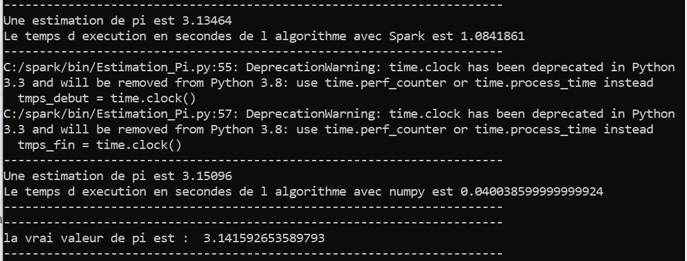

# Estimation de pi
- se trouver dans le bon répertoire de travail dans le terminal ( exemple: spark/bin)

- taper les commandes suivantes pour lancer le code : spark-submit Estimation_Pi.py

- Pour n= 100 000, on obtient :

- 
n = 100 000    | spark         |  numpy
------------- | ------------- | --------
Temps d'exécution  |  1.08 sec | 0.04 sec
Valeurs de pi   | 3.13464  | 3.15096
écart % Math.pi | 0.22% | 0.30%

- 
n = 1 000 000    | spark         |  numpy
------------- | ------------- | --------
Temps d'exécution  |  5.97 sec | 1.17 sec
Valeurs de pi   | 3.14224  | 3.13931
écart % Math.pi | 0.02% | 0.07%

- On remarque que pour n = 1 000 000, l'erreur est plus faible. On remarque également que le temps d'exécution avec Spark est plus important (environ 6 sec) que le temps d'exécution avec Numpy (environ 1 sec).

 
